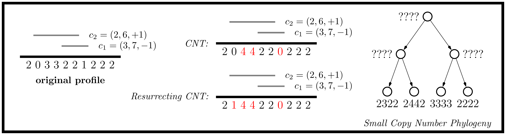

# Breaked: resurrecting the copy number transformation model

*Breaked* is a tool for inferring single-cell resolution copy number
phylogenies from copy number data. It is based on our *resurrecting
copy number transformation* (RCNT) model, which we recently introduced
as a simplification of the *copy number transformation* (CNT) model.
Our algorithm uses tree search and an efficient solver of the small
parsimony problem to find trees.



If you find this tool useful in your research, please cite us at:
```
```

## Installation

`Breaked` is implemented in C++ and is packaged with the dependencies
needed to execute the program. In particular, the only dependencies are
a recent version of CMAKE and a modern C++17 compliant compiler.

To build `Breaked`, execute the following sequence of commands:
```
$ mkdir build; cd build
$ cmake ..
# make
```
The output binary will be located at `build/src/breaked`.

## Usage

To run *breaked*, simply execute the binary. 
```
Usage: breaked [--help] [--version] {distance,nni}

Optional arguments:
  -h, --help   	shows help message and exits 
  -v, --version	prints version information and exits 

Subcommands:
  distance      Computes a distance matrix on copy number profiles
  nni           Infers a copy number tree using NNI operations
```

The tool has two modes: distance matrix construction using the RCNT
distance and a heuristic tree search algorithm for the RCNT large
parsimony problem. The `distance` mode takes copy number profiles as
input. The `nni` mode takes both copy number profiles and a Newick
tree as input.

### Input format

The input format for *breaked* consists of copy number profiles and
Newick trees on the profiles. The format for a copy number profile is
a CSV consisting of at least five columns named `node`, `chrom`,
`start`, `end`, and `cn_X`.  In particular, `node` is the name of the
cell, the triple (`chrom`, `start`, `end`) describes the copy number
bin, and `cn_a` is the number of copies of the locus on the `a`
allele. Since you can have varying numbers of alleles, we allow the
number of columns to vary. The Newick file must specify a *binary*
tree and the leaves of the tree must identify the cells in the `node`
column of the copy number profiles.

An example input format CSV is given
`examples/PTX008_cn_profiles.csv`.

## Usage Example

We will construct a topology on bulk tumor sequencing data from
patient 8 studied in Gundem et al. 2015. First, we will
compute the distance matrix using the following command:
```
$ breaked distance examples/PTX008_cn_profile.csv -o examples/PTX008
```

Then, we will perform neighbor joining on the distance matrix to
obtain a starting tree for our large parsimony tree search algorithm and then
arbitrarily resolve polytomies to make the tree binary
```
$ python scripts/nj.py examples/PTX008_dist_matrix.csv --output examples/PTX008_rcnt_nj_tree.newick
$ python scripts/resolve_polytomies.py examples/PTX008_rcnt_nj_tree.newick --output examples/PTX008_rcnt_nj_tree.binary.newick

```

Finally, we will run `breaked nni` to improve upon the candidate
topology.

```
breaked nni examples/PTX008_cn_profile.csv examples/PTX008_rcnt_nj_tree.binary.newick -a 2 -o ../examples/PTX008_rcnt_tree.binary.newick
```
